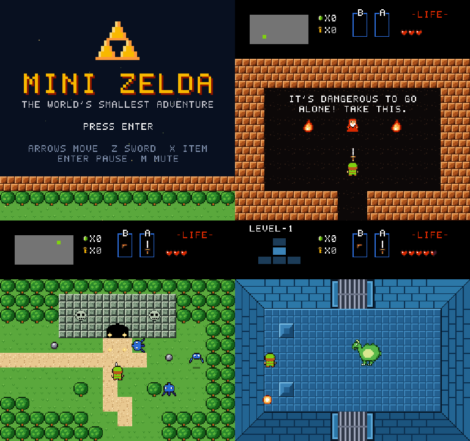

# Mini Zelda

**The world's smallest classic Zelda.** A complete top-down adventure in the style of the NES original,
squeezed into a 2×2 overworld, three caves and a five-room dungeon.

**▶ Play it here: https://mattias800.github.io/minizelda/**



It's a fan-made homage built from scratch: every sprite, tile, font glyph, song and sound effect is
generated in code (no external assets), running on a plain HTML5 canvas at the NES resolution of 256×240.

## The adventure

- An old man in a cave warns you that _it's dangerous to go alone_ and hands you a sword.
- Octoroks spit rocks (block them with your shield by facing them), Tektites hop around.
- One bush hides a secret. _It's a secret to everybody._
- A merchant will sell you a heart container, if you can afford it.
- Level 1: bats, skeletons, shutter doors, a locked door, a treasure chest with the boomerang,
  a key you can't reach on foot, and a fire-breathing dragon guarding the Triforce.

A full run takes about 5–10 minutes.

## Controls

| Action | Keyboard                | Gamepad |
| ------ | ----------------------- | ------- |
| Move   | Arrow keys / WASD       | D-pad / left stick |
| Sword  | Z / Space / J           | A |
| Item   | X / K                   | B / X |
| Pause  | Enter / Esc / P         | Start |
| Mute   | M                       | |

At full health the sword shoots a beam.

## Running locally

Requires Node 20+.

```sh
npm install
npm run dev        # http://localhost:5173
npm test           # unit + headless gameplay tests
npm run build      # production build in dist/
```

Pushing to `main` runs the tests and deploys to GitHub Pages.

### Dev tools

- **Sprite viewer:** `http://localhost:5173/sprites.html` renders every sprite
  (`?filter=hero,dragon&scale=6` to zoom in).
- **Jump to any room** (dev server only):
  `http://localhost:5173/?room=d_boss&items=sword,boomerang&hearts=5&keys=1&rupees=50&x=3&y=5`
  In dev, the running game is also available as `window.game`.

## Code tour

TypeScript, Vite, zero runtime dependencies. The simulation runs at a fixed 60 steps per second;
all speeds are pixels per frame.

```
src/
  main.ts              boot, canvas scaling, dev room-jump
  engine/              constants, math (Dir, Rect, seeded Rng), keyboard/gamepad input
  gfx/
    pixelart.ts        sprites as palette-indexed strings + pure transforms (flip, rotate, recolor)
    art/               all the pixel art: hero, enemies, items, tiles, effects
    renderer.ts        rasterizes art to canvases (cached, with hurt-flash palette variants), text
    font.ts            5x7 bitmap font
  audio/
    audio.ts           WebAudio chiptune engine: lookahead sequencer + synthesized SFX
    tracks.ts          the (original) music, written as note strings
  world/
    rooms.ts           THE WORLD: every room's map, enemies, objects, doors, warps
    tiles.ts           tile legend (solid? cuttable? warp?)
    tilemap.ts         per-room tile grid and collision queries
  entities/            Player, enemies, projectiles, boomerang, pickups, decorations, effects
  game/
    game.ts            main loop and scene switching
    state.ts           persistent progress (hearts, rupees, items, flags)
    room.ts            a live room: map + entities + door states
    roomRenderer.ts    tiles plus procedurally drawn dungeon walls and doors
  scenes/              title, play (the core loop, implements the World API), game over, ending
  ui/                  HUD and pause screen
tests/                 world integrity, art validation, music, and headless gameplay tests
```

### Extending the world

- **Add a room:** add a `RoomDef` to `src/world/rooms.ts`. Rooms in the same `area` with adjacent
  `gx/gy` connect automatically by scrolling; caves and stairs use `warps` and `exits`.
  Dungeon rooms are written as a 12×7 interior and get walls and doors from `dungeonMap()`.
  `tests/world.test.ts` checks that edges line up, warps land on walkable ground and every room is reachable.
- **Add an enemy:** subclass `Enemy` (or `GridWalker` for NES-style wandering), draw it in
  `src/gfx/art/enemies.ts` and register it in `src/entities/enemies/index.ts`.
- **Add an item:** extend `ItemKind`, give it a sprite in `ITEM_SPRITE` and handle it in
  `PlayScene.collectItem`.
- **Persistent events** (opened doors, found secrets, cleared rooms, collected items) are string
  flags on `GameState`.

## Credits

A fan tribute to _The Legend of Zelda_ (Nintendo, 1986). Not affiliated with or endorsed by Nintendo.
All art, music and code in this repository are original.
